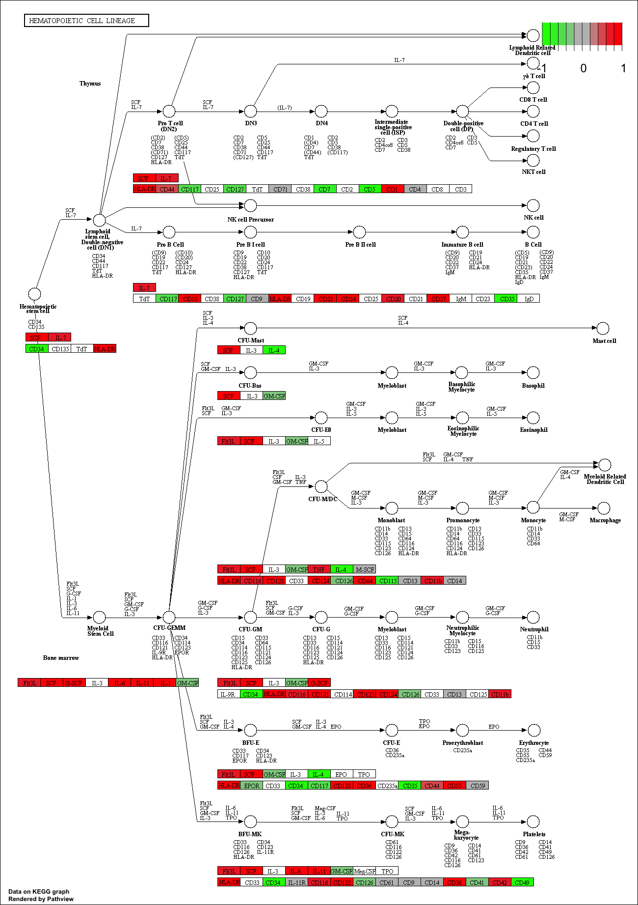
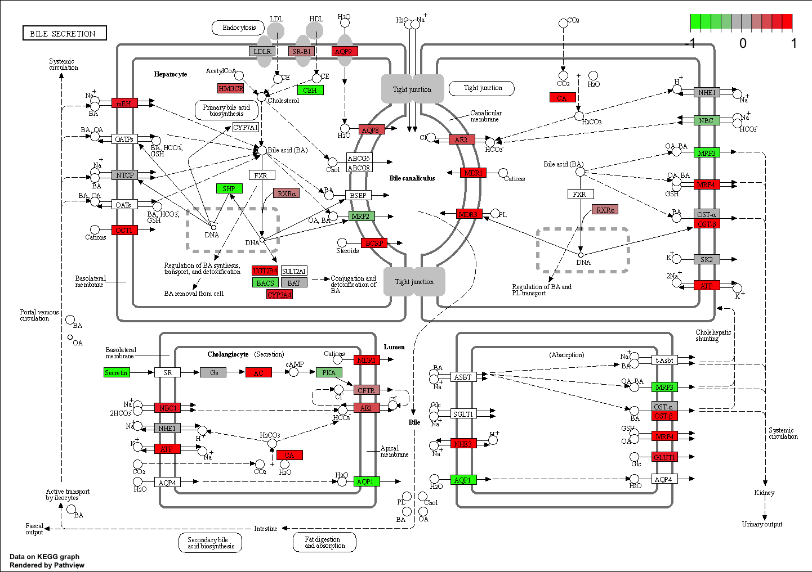

Class16: RNASeq Mini Project
================
Wai Lam Adele Hong A15999023
11/18/2021

``` r
metaFile <- "GSE37704_metadata.csv"
countFile <- "GSE37704_featurecounts.csv"

# Import metadata and take a peek
colData = read.csv(metaFile, row.names=1)
head(colData)
```

    ##               condition
    ## SRR493366 control_sirna
    ## SRR493367 control_sirna
    ## SRR493368 control_sirna
    ## SRR493369      hoxa1_kd
    ## SRR493370      hoxa1_kd
    ## SRR493371      hoxa1_kd

``` r
# Import countdata
countData = read.csv(countFile, row.names=1)
head(countData)
```

    ##                 length SRR493366 SRR493367 SRR493368 SRR493369 SRR493370
    ## ENSG00000186092    918         0         0         0         0         0
    ## ENSG00000279928    718         0         0         0         0         0
    ## ENSG00000279457   1982        23        28        29        29        28
    ## ENSG00000278566    939         0         0         0         0         0
    ## ENSG00000273547    939         0         0         0         0         0
    ## ENSG00000187634   3214       124       123       205       207       212
    ##                 SRR493371
    ## ENSG00000186092         0
    ## ENSG00000279928         0
    ## ENSG00000279457        46
    ## ENSG00000278566         0
    ## ENSG00000273547         0
    ## ENSG00000187634       258

**Q1.** Complete the code below to remove the troublesome first column
from countData. We need to get rid of this funny first column.

``` r
countData <- countData[, -1]
head(countData)
```

    ##                 SRR493366 SRR493367 SRR493368 SRR493369 SRR493370 SRR493371
    ## ENSG00000186092         0         0         0         0         0         0
    ## ENSG00000279928         0         0         0         0         0         0
    ## ENSG00000279457        23        28        29        29        28        46
    ## ENSG00000278566         0         0         0         0         0         0
    ## ENSG00000273547         0         0         0         0         0         0
    ## ENSG00000187634       124       123       205       207       212       258

``` r
#We should have 6 rows and 6 columns! If we run the [, -1] code again and again, each time it will get rid of the first column until you're left with 0 columns. 
```

**Q2.** Complete the code below to filter countData to exclude genes
(i.e. rows) where we have 0 read count across all samples
(i.e. columns).

``` r
head(countData)
```

    ##                 SRR493366 SRR493367 SRR493368 SRR493369 SRR493370 SRR493371
    ## ENSG00000186092         0         0         0         0         0         0
    ## ENSG00000279928         0         0         0         0         0         0
    ## ENSG00000279457        23        28        29        29        28        46
    ## ENSG00000278566         0         0         0         0         0         0
    ## ENSG00000273547         0         0         0         0         0         0
    ## ENSG00000187634       124       123       205       207       212       258

``` r
countsnozero <- countData[rowSums(countData) !=0,]
```

``` r
# BiocManager::install("DESeq2")
library(DESeq2)
```

    ## Loading required package: S4Vectors

    ## Loading required package: stats4

    ## Loading required package: BiocGenerics

    ## 
    ## Attaching package: 'BiocGenerics'

    ## The following objects are masked from 'package:stats':
    ## 
    ##     IQR, mad, sd, var, xtabs

    ## The following objects are masked from 'package:base':
    ## 
    ##     anyDuplicated, append, as.data.frame, basename, cbind, colnames,
    ##     dirname, do.call, duplicated, eval, evalq, Filter, Find, get, grep,
    ##     grepl, intersect, is.unsorted, lapply, Map, mapply, match, mget,
    ##     order, paste, pmax, pmax.int, pmin, pmin.int, Position, rank,
    ##     rbind, Reduce, rownames, sapply, setdiff, sort, table, tapply,
    ##     union, unique, unsplit, which.max, which.min

    ## 
    ## Attaching package: 'S4Vectors'

    ## The following objects are masked from 'package:base':
    ## 
    ##     expand.grid, I, unname

    ## Loading required package: IRanges

    ## Loading required package: GenomicRanges

    ## Warning: package 'GenomicRanges' was built under R version 4.1.2

    ## Loading required package: GenomeInfoDb

    ## Loading required package: SummarizedExperiment

    ## Loading required package: MatrixGenerics

    ## Loading required package: matrixStats

    ## 
    ## Attaching package: 'MatrixGenerics'

    ## The following objects are masked from 'package:matrixStats':
    ## 
    ##     colAlls, colAnyNAs, colAnys, colAvgsPerRowSet, colCollapse,
    ##     colCounts, colCummaxs, colCummins, colCumprods, colCumsums,
    ##     colDiffs, colIQRDiffs, colIQRs, colLogSumExps, colMadDiffs,
    ##     colMads, colMaxs, colMeans2, colMedians, colMins, colOrderStats,
    ##     colProds, colQuantiles, colRanges, colRanks, colSdDiffs, colSds,
    ##     colSums2, colTabulates, colVarDiffs, colVars, colWeightedMads,
    ##     colWeightedMeans, colWeightedMedians, colWeightedSds,
    ##     colWeightedVars, rowAlls, rowAnyNAs, rowAnys, rowAvgsPerColSet,
    ##     rowCollapse, rowCounts, rowCummaxs, rowCummins, rowCumprods,
    ##     rowCumsums, rowDiffs, rowIQRDiffs, rowIQRs, rowLogSumExps,
    ##     rowMadDiffs, rowMads, rowMaxs, rowMeans2, rowMedians, rowMins,
    ##     rowOrderStats, rowProds, rowQuantiles, rowRanges, rowRanks,
    ##     rowSdDiffs, rowSds, rowSums2, rowTabulates, rowVarDiffs, rowVars,
    ##     rowWeightedMads, rowWeightedMeans, rowWeightedMedians,
    ##     rowWeightedSds, rowWeightedVars

    ## Loading required package: Biobase

    ## Welcome to Bioconductor
    ## 
    ##     Vignettes contain introductory material; view with
    ##     'browseVignettes()'. To cite Bioconductor, see
    ##     'citation("Biobase")', and for packages 'citation("pkgname")'.

    ## 
    ## Attaching package: 'Biobase'

    ## The following object is masked from 'package:MatrixGenerics':
    ## 
    ##     rowMedians

    ## The following objects are masked from 'package:matrixStats':
    ## 
    ##     anyMissing, rowMedians

``` r
dds = DESeqDataSetFromMatrix(countData=countData,
                             colData=colData,
                             design=~condition)
```

    ## Warning in DESeqDataSet(se, design = design, ignoreRank): some variables in
    ## design formula are characters, converting to factors

``` r
dds = DESeq(dds)
```

    ## estimating size factors

    ## estimating dispersions

    ## gene-wise dispersion estimates

    ## mean-dispersion relationship

    ## final dispersion estimates

    ## fitting model and testing

``` r
dds
```

    ## class: DESeqDataSet 
    ## dim: 19808 6 
    ## metadata(1): version
    ## assays(4): counts mu H cooks
    ## rownames(19808): ENSG00000186092 ENSG00000279928 ... ENSG00000277475
    ##   ENSG00000268674
    ## rowData names(22): baseMean baseVar ... deviance maxCooks
    ## colnames(6): SRR493366 SRR493367 ... SRR493370 SRR493371
    ## colData names(2): condition sizeFactor

**Q3.** Call the summary() function on your results to get a sense of
how many genes are up or down-regulated at the default 0.1 p-value
cutoff.

``` r
res = results(dds, contrast=c("condition", "hoxa1_kd", "control_sirna"))

summary(res)
```

    ## 
    ## out of 15975 with nonzero total read count
    ## adjusted p-value < 0.1
    ## LFC > 0 (up)       : 4349, 27%
    ## LFC < 0 (down)     : 4393, 27%
    ## outliers [1]       : 0, 0%
    ## low counts [2]     : 1221, 7.6%
    ## (mean count < 0)
    ## [1] see 'cooksCutoff' argument of ?results
    ## [2] see 'independentFiltering' argument of ?results

##Volcano Plot

``` r
plot( res$log2FoldChange, -log(res$padj) )
```

<!-- -->

**Q4.** Improve this plot by completing the below code, which adds color
and axis labels.

``` r
# Make a color vector for all genes
mycols <- rep("gray", nrow(res) )

# Color red the genes with absolute fold change above 2
mycols[ abs(res$log2FoldChange) > 2 ] <- "red"

# Color blue those with adjusted p-value less than 0.01
#  and absolute fold change more than 2
inds <- (res$pvalue < 0.01) & (abs(res$log2FoldChange) > 2 )
mycols[ inds ] <- "blue"

plot( res$log2FoldChange, -log(res$padj), col=mycols, xlab="Log2(FoldChange)", ylab="-Log(P-value)" )
```

<!-- -->

``` r
library("AnnotationDbi")
```

    ## Warning: package 'AnnotationDbi' was built under R version 4.1.2

``` r
library("org.Hs.eg.db")
```

    ## 

``` r
columns(org.Hs.eg.db)
```

    ##  [1] "ACCNUM"       "ALIAS"        "ENSEMBL"      "ENSEMBLPROT"  "ENSEMBLTRANS"
    ##  [6] "ENTREZID"     "ENZYME"       "EVIDENCE"     "EVIDENCEALL"  "GENENAME"    
    ## [11] "GENETYPE"     "GO"           "GOALL"        "IPI"          "MAP"         
    ## [16] "OMIM"         "ONTOLOGY"     "ONTOLOGYALL"  "PATH"         "PFAM"        
    ## [21] "PMID"         "PROSITE"      "REFSEQ"       "SYMBOL"       "UCSCKG"      
    ## [26] "UNIPROT"

``` r
res$symbol <- mapIds(org.Hs.eg.db,
                     keys=row.names(res),
                     keytype="ENSEMBL",
                     column="ENTREZID",
                     multiVals="first")
```

    ## 'select()' returned 1:many mapping between keys and columns

``` r
res$entrez = mapIds(org.Hs.eg.db,
                    keys=row.names(res),
                    keytype="ENSEMBL",
                    column="ENTREZID",
                    multiVals="first")
```

    ## 'select()' returned 1:many mapping between keys and columns

``` r
res$name =   mapIds(org.Hs.eg.db,
                    keys=row.names(res),
                    keytype="ENSEMBL",
                    column="ENTREZID",
                    multiVals="first")
```

    ## 'select()' returned 1:many mapping between keys and columns

``` r
head(res, 10)
```

    ## log2 fold change (MLE): condition hoxa1_kd vs control_sirna 
    ## Wald test p-value: condition hoxa1 kd vs control sirna 
    ## DataFrame with 10 rows and 9 columns
    ##                  baseMean log2FoldChange     lfcSE       stat      pvalue
    ##                 <numeric>      <numeric> <numeric>  <numeric>   <numeric>
    ## ENSG00000186092    0.0000             NA        NA         NA          NA
    ## ENSG00000279928    0.0000             NA        NA         NA          NA
    ## ENSG00000279457   29.9136      0.1792571 0.3248216   0.551863 5.81042e-01
    ## ENSG00000278566    0.0000             NA        NA         NA          NA
    ## ENSG00000273547    0.0000             NA        NA         NA          NA
    ## ENSG00000187634  183.2296      0.4264571 0.1402658   3.040350 2.36304e-03
    ## ENSG00000188976 1651.1881     -0.6927205 0.0548465 -12.630158 1.43990e-36
    ## ENSG00000187961  209.6379      0.7297556 0.1318599   5.534326 3.12428e-08
    ## ENSG00000187583   47.2551      0.0405765 0.2718928   0.149237 8.81366e-01
    ## ENSG00000187642   11.9798      0.5428105 0.5215598   1.040744 2.97994e-01
    ##                        padj      symbol      entrez        name
    ##                   <numeric> <character> <character> <character>
    ## ENSG00000186092          NA       79501       79501       79501
    ## ENSG00000279928          NA          NA          NA          NA
    ## ENSG00000279457 6.87080e-01   102723897   102723897   102723897
    ## ENSG00000278566          NA          NA          NA          NA
    ## ENSG00000273547          NA          NA          NA          NA
    ## ENSG00000187634 5.16278e-03      148398      148398      148398
    ## ENSG00000188976 1.76741e-35       26155       26155       26155
    ## ENSG00000187961 1.13536e-07      339451      339451      339451
    ## ENSG00000187583 9.18988e-01       84069       84069       84069
    ## ENSG00000187642 4.03817e-01       84808       84808       84808

``` r
pca <- prcomp(t(countsnozero))
mycols <- rep(c("red", "blue"), each=3)
plot(pca$x[,1:2], col=mycols, pch=16)
```

<!-- -->

``` r
# Run in your R console (i.e. not your Rmarkdown doc!)
# BiocManager::install( c("pathview", "gage", "gageData") )

library(pathview)
```

    ## ##############################################################################
    ## Pathview is an open source software package distributed under GNU General
    ## Public License version 3 (GPLv3). Details of GPLv3 is available at
    ## http://www.gnu.org/licenses/gpl-3.0.html. Particullary, users are required to
    ## formally cite the original Pathview paper (not just mention it) in publications
    ## or products. For details, do citation("pathview") within R.
    ## 
    ## The pathview downloads and uses KEGG data. Non-academic uses may require a KEGG
    ## license agreement (details at http://www.kegg.jp/kegg/legal.html).
    ## ##############################################################################

``` r
library(gage)
```

    ## 

``` r
library(gageData)

# Focus on datasubset of KEGG
data(kegg.sets.hs)
data(sigmet.idx.hs)

# Focus on signaling and metabolic pathways only
kegg.sets.hs = kegg.sets.hs[sigmet.idx.hs]

# Examine the first 3 pathways
head(kegg.sets.hs, 3)
```

    ## $`hsa00232 Caffeine metabolism`
    ## [1] "10"   "1544" "1548" "1549" "1553" "7498" "9"   
    ## 
    ## $`hsa00983 Drug metabolism - other enzymes`
    ##  [1] "10"     "1066"   "10720"  "10941"  "151531" "1548"   "1549"   "1551"  
    ##  [9] "1553"   "1576"   "1577"   "1806"   "1807"   "1890"   "221223" "2990"  
    ## [17] "3251"   "3614"   "3615"   "3704"   "51733"  "54490"  "54575"  "54576" 
    ## [25] "54577"  "54578"  "54579"  "54600"  "54657"  "54658"  "54659"  "54963" 
    ## [33] "574537" "64816"  "7083"   "7084"   "7172"   "7363"   "7364"   "7365"  
    ## [41] "7366"   "7367"   "7371"   "7372"   "7378"   "7498"   "79799"  "83549" 
    ## [49] "8824"   "8833"   "9"      "978"   
    ## 
    ## $`hsa00230 Purine metabolism`
    ##   [1] "100"    "10201"  "10606"  "10621"  "10622"  "10623"  "107"    "10714" 
    ##   [9] "108"    "10846"  "109"    "111"    "11128"  "11164"  "112"    "113"   
    ##  [17] "114"    "115"    "122481" "122622" "124583" "132"    "158"    "159"   
    ##  [25] "1633"   "171568" "1716"   "196883" "203"    "204"    "205"    "221823"
    ##  [33] "2272"   "22978"  "23649"  "246721" "25885"  "2618"   "26289"  "270"   
    ##  [41] "271"    "27115"  "272"    "2766"   "2977"   "2982"   "2983"   "2984"  
    ##  [49] "2986"   "2987"   "29922"  "3000"   "30833"  "30834"  "318"    "3251"  
    ##  [57] "353"    "3614"   "3615"   "3704"   "377841" "471"    "4830"   "4831"  
    ##  [65] "4832"   "4833"   "4860"   "4881"   "4882"   "4907"   "50484"  "50940" 
    ##  [73] "51082"  "51251"  "51292"  "5136"   "5137"   "5138"   "5139"   "5140"  
    ##  [81] "5141"   "5142"   "5143"   "5144"   "5145"   "5146"   "5147"   "5148"  
    ##  [89] "5149"   "5150"   "5151"   "5152"   "5153"   "5158"   "5167"   "5169"  
    ##  [97] "51728"  "5198"   "5236"   "5313"   "5315"   "53343"  "54107"  "5422"  
    ## [105] "5424"   "5425"   "5426"   "5427"   "5430"   "5431"   "5432"   "5433"  
    ## [113] "5434"   "5435"   "5436"   "5437"   "5438"   "5439"   "5440"   "5441"  
    ## [121] "5471"   "548644" "55276"  "5557"   "5558"   "55703"  "55811"  "55821" 
    ## [129] "5631"   "5634"   "56655"  "56953"  "56985"  "57804"  "58497"  "6240"  
    ## [137] "6241"   "64425"  "646625" "654364" "661"    "7498"   "8382"   "84172" 
    ## [145] "84265"  "84284"  "84618"  "8622"   "8654"   "87178"  "8833"   "9060"  
    ## [153] "9061"   "93034"  "953"    "9533"   "954"    "955"    "956"    "957"   
    ## [161] "9583"   "9615"

``` r
foldchanges = res$log2FoldChange
names(foldchanges) = res$entrez
head(foldchanges)
```

    ##     79501      <NA> 102723897      <NA>      <NA>    148398 
    ##        NA        NA 0.1792571        NA        NA 0.4264571

Let’s run the gage pathway analysis.

``` r
# Get the results
keggres = gage(foldchanges, gsets=kegg.sets.hs)

attributes(keggres)
```

    ## $names
    ## [1] "greater" "less"    "stats"

Let’s look at the first few down-regulat4ed (less) pathways.

``` r
head(keggres$less)
```

    ##                                          p.geomean stat.mean        p.val
    ## hsa04110 Cell cycle                   7.077982e-06 -4.432593 7.077982e-06
    ## hsa03030 DNA replication              9.424076e-05 -3.951803 9.424076e-05
    ## hsa03013 RNA transport                1.012277e-03 -3.122555 1.012277e-03
    ## hsa04114 Oocyte meiosis               2.563806e-03 -2.827297 2.563806e-03
    ## hsa03440 Homologous recombination     3.066756e-03 -2.852899 3.066756e-03
    ## hsa00010 Glycolysis / Gluconeogenesis 4.360092e-03 -2.663825 4.360092e-03
    ##                                             q.val set.size         exp1
    ## hsa04110 Cell cycle                   0.001160789      124 7.077982e-06
    ## hsa03030 DNA replication              0.007727742       36 9.424076e-05
    ## hsa03013 RNA transport                0.055337821      150 1.012277e-03
    ## hsa04114 Oocyte meiosis               0.100589607      112 2.563806e-03
    ## hsa03440 Homologous recombination     0.100589607       28 3.066756e-03
    ## hsa00010 Glycolysis / Gluconeogenesis 0.119175854       65 4.360092e-03

Using the **pathview()** function, we will make pathway plot for the
RNASeq. expression results.

``` r
pathview(gene.data=foldchanges, pathway.id="hsa04110")
```

    ## 'select()' returned 1:1 mapping between keys and columns

    ## Info: Working in directory /Users/adelehong/BIMM 143/bimm143_github/Class16

    ## Info: Writing image file hsa04110.pathview.png


``` r
# A different PDF based output of the same data
pathview(gene.data=foldchanges, pathway.id="hsa04110", kegg.native=FALSE)
```

    ## 'select()' returned 1:1 mapping between keys and columns

    ## Info: Working in directory /Users/adelehong/BIMM 143/bimm143_github/Class16

    ## Info: Writing image file hsa04110.pathview.pdf

``` r
## Focus on top 5 upregulated pathways here for demo purposes only
keggrespathwaysup <- rownames(keggres$greater)[1:5]

# Extract the 8 character long IDs part of each string
keggresidsup = substr(keggrespathwaysup, start=1, stop=8)
keggresidsup
```

    ## [1] "hsa04740" "hsa04640" "hsa00140" "hsa04630" "hsa04976"

Let’s use **pathview()** for all top 5 up-regulated pathways.

``` r
pathview(gene.data=foldchanges, pathway.id=keggresidsup, species="hsa")
```

    ## 'select()' returned 1:1 mapping between keys and columns

    ## Info: Working in directory /Users/adelehong/BIMM 143/bimm143_github/Class16

    ## Info: Writing image file hsa04740.pathview.png

    ## Info: some node width is different from others, and hence adjusted!

    ## 'select()' returned 1:1 mapping between keys and columns

    ## Info: Working in directory /Users/adelehong/BIMM 143/bimm143_github/Class16

    ## Info: Writing image file hsa04640.pathview.png

    ## 'select()' returned 1:1 mapping between keys and columns

    ## Info: Working in directory /Users/adelehong/BIMM 143/bimm143_github/Class16

    ## Info: Writing image file hsa00140.pathview.png

    ## 'select()' returned 1:1 mapping between keys and columns

    ## Info: Working in directory /Users/adelehong/BIMM 143/bimm143_github/Class16

    ## Info: Writing image file hsa04630.pathview.png

    ## 'select()' returned 1:1 mapping between keys and columns

    ## Info: Working in directory /Users/adelehong/BIMM 143/bimm143_github/Class16

    ## Info: Writing image file hsa04976.pathview.png

 
 


**Q7.** Can you do the same procedure as above to plot the pathview
figures for the top 5 down-reguled pathways?

``` r
## Focus on top 5 down-regulated pathways here for demo purposes only
keggrespathwaysdown <- rownames(keggres$less)[1:5]

# Extract the 8 character long IDs part of each string
keggresidsdown = substr(keggrespathwaysdown, start=1, stop=8)
keggresidsdown
```

    ## [1] "hsa04110" "hsa03030" "hsa03013" "hsa04114" "hsa03440"

``` r
pathview(gene.data=foldchanges, pathway.id=keggresidsdown, species="hsa")
```

    ## 'select()' returned 1:1 mapping between keys and columns

    ## Info: Working in directory /Users/adelehong/BIMM 143/bimm143_github/Class16

    ## Info: Writing image file hsa04110.pathview.png

    ## 'select()' returned 1:1 mapping between keys and columns

    ## Info: Working in directory /Users/adelehong/BIMM 143/bimm143_github/Class16

    ## Info: Writing image file hsa03030.pathview.png

    ## 'select()' returned 1:1 mapping between keys and columns

    ## Info: Working in directory /Users/adelehong/BIMM 143/bimm143_github/Class16

    ## Info: Writing image file hsa03013.pathview.png

    ## 'select()' returned 1:1 mapping between keys and columns

    ## Info: Working in directory /Users/adelehong/BIMM 143/bimm143_github/Class16

    ## Info: Writing image file hsa04114.pathview.png

    ## 'select()' returned 1:1 mapping between keys and columns

    ## Info: Working in directory /Users/adelehong/BIMM 143/bimm143_github/Class16

    ## Info: Writing image file hsa03440.pathview.png

 
 


## Gene Ontology

``` r
data(go.sets.hs)
data(go.subs.hs)

# Focus on Biological Process subset of GO
gobpsets = go.sets.hs[go.subs.hs$BP]

gobpres = gage(foldchanges, gsets=gobpsets, same.dir=TRUE)

lapply(gobpres, head)
```

    ## $greater
    ##                                               p.geomean stat.mean        p.val
    ## GO:0007156 homophilic cell adhesion        1.624062e-05  4.226117 1.624062e-05
    ## GO:0048729 tissue morphogenesis            5.407952e-05  3.888470 5.407952e-05
    ## GO:0002009 morphogenesis of an epithelium  5.727599e-05  3.878706 5.727599e-05
    ## GO:0030855 epithelial cell differentiation 2.053700e-04  3.554776 2.053700e-04
    ## GO:0060562 epithelial tube morphogenesis   2.927804e-04  3.458463 2.927804e-04
    ## GO:0048598 embryonic morphogenesis         2.959270e-04  3.446527 2.959270e-04
    ##                                                 q.val set.size         exp1
    ## GO:0007156 homophilic cell adhesion        0.07103646      138 1.624062e-05
    ## GO:0048729 tissue morphogenesis            0.08350839      483 5.407952e-05
    ## GO:0002009 morphogenesis of an epithelium  0.08350839      382 5.727599e-05
    ## GO:0030855 epithelial cell differentiation 0.15370245      299 2.053700e-04
    ## GO:0060562 epithelial tube morphogenesis   0.15370245      289 2.927804e-04
    ## GO:0048598 embryonic morphogenesis         0.15370245      498 2.959270e-04
    ## 
    ## $less
    ##                                             p.geomean stat.mean        p.val
    ## GO:0048285 organelle fission             6.386337e-16 -8.175381 6.386337e-16
    ## GO:0000280 nuclear division              1.726380e-15 -8.056666 1.726380e-15
    ## GO:0007067 mitosis                       1.726380e-15 -8.056666 1.726380e-15
    ## GO:0000087 M phase of mitotic cell cycle 4.593581e-15 -7.919909 4.593581e-15
    ## GO:0007059 chromosome segregation        9.576332e-12 -6.994852 9.576332e-12
    ## GO:0051301 cell division                 8.718528e-11 -6.455491 8.718528e-11
    ##                                                 q.val set.size         exp1
    ## GO:0048285 organelle fission             2.517062e-12      386 6.386337e-16
    ## GO:0000280 nuclear division              2.517062e-12      362 1.726380e-15
    ## GO:0007067 mitosis                       2.517062e-12      362 1.726380e-15
    ## GO:0000087 M phase of mitotic cell cycle 5.023080e-12      373 4.593581e-15
    ## GO:0007059 chromosome segregation        8.377375e-09      146 9.576332e-12
    ## GO:0051301 cell division                 6.355807e-08      479 8.718528e-11
    ## 
    ## $stats
    ##                                            stat.mean     exp1
    ## GO:0007156 homophilic cell adhesion         4.226117 4.226117
    ## GO:0048729 tissue morphogenesis             3.888470 3.888470
    ## GO:0002009 morphogenesis of an epithelium   3.878706 3.878706
    ## GO:0030855 epithelial cell differentiation  3.554776 3.554776
    ## GO:0060562 epithelial tube morphogenesis    3.458463 3.458463
    ## GO:0048598 embryonic morphogenesis          3.446527 3.446527

## Reactome Analysis

We can also do a similar procedure with gene ontology. Similar to above,
go.sets.hs has all GO terms. go.subs.hs is a named list containing
indexes for the BP, CC, and MF ontologies. Let’s focus on BP (a.k.a
Biological Process) here.

## Reactome Analysis

Reactome is database consisting of biological molecules and their
relation to pathways and processes.

``` r
# output the list of significant genes at the 0.05 level as a plain text file:
sig_genes <- res[res$padj <= 0.05 & !is.na(res$padj), "symbol"]
print(paste("Total number of significant genes:", length(sig_genes)))
```

    ## [1] "Total number of significant genes: 8146"

``` r
write.table(sig_genes, file="significant_genes.txt", row.names=FALSE, col.names=FALSE, quote=FALSE)
```

**Q8.** What pathway has the most significant “Entities p-value”? Do the
most significant pathways listed match your previous KEGG results? What
factors could cause differences between the two methods?

``` r
# Performed significant gene analysis on https://reactome.org/PathwayBrowser/#TOOL=AT website. Downloaded pathway analysis results for genes with most significant p values as .csv file. Read file using **read.csv()** function.
mostsignificant <- read.csv(file="result.csv")
head(mostsignificant)
```

    ##   Pathway.identifier
    ## 1      R-HSA-9716542
    ## 2      R-HSA-9012999
    ## 3        R-HSA-69618
    ## 4       R-HSA-141424
    ## 5       R-HSA-141444
    ## 6       R-HSA-194315
    ##                                                                           Pathway.name
    ## 1                                   Signaling by Rho GTPases, Miro GTPases and RHOBTB3
    ## 2                                                                     RHO GTPase cycle
    ## 3                                                           Mitotic Spindle Checkpoint
    ## 4                                        Amplification of signal from the kinetochores
    ## 5 Amplification  of signal from unattached  kinetochores via a MAD2  inhibitory signal
    ## 6                                                             Signaling by Rho GTPases
    ##   X.Entities.found X.Entities.total Entities.ratio Entities.pValue Entities.FDR
    ## 1              495              725    0.050802326     0.006251003    0.7958572
    ## 2              323              460    0.032233200     0.006517206    0.7958572
    ## 3               89              111    0.007778011     0.007440536    0.7958572
    ## 4               77               94    0.006586784     0.007543102    0.7958572
    ## 5               77               94    0.006586784     0.007543102    0.7958572
    ## 6              483              709    0.049681172     0.007827996    0.7958572
    ##   X.Reactions.found X.Reactions.total Reactions.ratio Species.identifier
    ## 1               204               212    0.0156146424               9606
    ## 2                84                91    0.0067025116               9606
    ## 3                 7                 7    0.0005155778               9606
    ## 4                 4                 4    0.0002946159               9606
    ## 5                 4                 4    0.0002946159               9606
    ## 6               195               203    0.0149517566               9606
    ##   Species.name
    ## 1 Homo sapiens
    ## 2 Homo sapiens
    ## 3 Homo sapiens
    ## 4 Homo sapiens
    ## 5 Homo sapiens
    ## 6 Homo sapiens
    ##                                                                                                                                                                                                                                                                                                                                                                                                                                                                                                                                                                                                                                                                                                                                                                                                                                                                                                                                                                                                                                                                                                                                                                                                                                                                                                                                                                                                                                                                                                                                                                                                                                                                                                                                                                                                                                                                                                                                                                                                                                                                                                                                                                                                                                                                                                                                                                                                                                                                                                                                                                                                                                                                                                                                                                                                                                                                                                                                                                                                                                                                                                                                                                                                                     Submitted.entities.found
    ## 1 908;25904;65124;2551;1460;9181;9184;25900;2669;79658;253959;5930;91526;3998;23616;81839;115703;201176;2316;10788;2677;57636;57630;801;55219;2319;64283;10424;10787;1362;2690;143098;22852;4628;4629;57405;55227;29127;26099;2200;57522;3895;27183;26091;26094;3658;4627;22989;1495;10403;124997;58504;81624;2697;80776;1123;2332;55114;701;27072;4637;708;4638;91452;22836;4771;4650;3320;29108;2230;90480;55240;27044;26073;6709;7919;1499;114793;10979;832;55004;3796;10970;3798;3799;4646;10971;4660;91445;91687;57551;84904;79682;27175;3329;26084;10505;1027;3326;5500;6711;5501;3688;5747;6714;4659;5880;5881;22818;2131;84936;2491;83607;83734;5519;57569;55023;79598;57449;55143;3215;284119;3336;613;6722;857;5756;5515;5516;5879;5518;92799;57572;91582;10602;57579;57216;2017;2137;253980;56122;10726;2135;2134;5528;10963;4690;5783;5300;6510;10250;3363;1063;2152;1062;991;151648;2026;995;1058;874;55968;54878;55845;10376;10134;4688;10254;10499;85480;10381;4221;10383;3376;23332;2043;23213;3251;2040;1072;2280;55971;51133;2157;55852;84033;4698;11113;7846;9901;10144;51138;55619;348235;6654;116985;2055;25963;23421;2054;3021;2294;147179;3020;3140;2050;56951;3017;51143;3015;79834;3014;537;8826;2180;4001;3155;64105;23431;2185;2181;54542;3146;79822;9928;9927;23526;8970;5580;6793;5585;6434;5586;286205;81929;3163;790;2071;81930;55766;7514;54438;5578;9815;10211;10574;7879;5216;5337;5338;157285;5594;5595;7532;8502;7531;7410;7534;7533;9710;10109;54443;90624;5347;9826;8976;9824;90627;10226;9828;5361;5364;8997;6453;8874;56990;3183;332;699;7415;55669;10552;8503;55789;10672;140735;25936;25814;4162;7431;23518;9855;9732;23633;23513;80728;79980;54108;7428;11180;6472;54908;11060;10092;8655;8776;7444;10097;7204;10096;9743;94240;28977;64837;29941;85415;151246;11188;9735;84681;8301;94239;7456;9754;3099;120;84317;143872;84790;348995;25;5289;9644;29;23265;220134;23268;57082;64857;23028;23380;6249;9639;51306;5295;4085;9411;7112;8440;9414;5058;28966;58189;28964;5290;200894;5170;387;388;389;54820;9528;54821;5063;6396;11140;8334;7126;2909;23122;23002;23365;390;391;392;5062;395;26999;397;121512;55920;85458;85457;25782;84364;2907;85450;9793;8345;85449;54962;1829;1949;60;85441;8339;85440;8476;10152;23221;23344;1832;1950;23580;84144;55704;89953;10395;71;8349;10398;51347;55701;9318;10276;347733;11004;8365;9212;7277;65992;5099;9217;10163;9578;11130;25894;182;55831;23592;79902;85465;128239;1729;85463;11135;85464;2937;1969;85461;55839;2935;55717;87;85460;93436;92105;55160;10928;7280;57584;9462;9341;91010;1855;10810;55288;55166;1730;56254;57222;80005;79019;1857;1856;22800;9235;93663;9475;8027;9590;10818;7170;9352;9231;7171;1503;79003;1742;55055;26286;81565;22919;1509;1629;1508;9367;158747;57120;29766;57122;6093;8153;84617;57480;1994;29886;147841;84986;1519;3930;51706;50619;9497;50618;157769;22906;9138;221178;401541;55075;79023;84858;1520;57498;84612;1781;26115;1780;79172;57381;1778;1535;1894;26112;30849;5905;30851;3728;2512;26122;2631;2873;347902;83540;80152;5903;23091;3980;29843;92285;2889;1434;2885;83696;50650;1793;5910;3619;3978;79180;27316;8086;64946;26108;9055;80179;23191;2776;1445;23074;23197;3983;30837;103910;51517;5924
    ## 2                                                                                                                                                                                                                                                                                                                                                                                                                                                                                                                                                                                                                                                                                                                                                                                                                                                                                                                                                                                                                                                                                                           6472;11180;908;25904;11060;8776;7444;65124;7204;9743;94240;2551;1460;9181;25900;29941;85415;79658;253959;11188;5930;91526;3998;84681;23616;8301;7456;9754;81839;3099;115703;120;201176;84317;143872;10788;57636;57630;55219;2319;64283;10424;10787;9644;29;23265;1362;23268;2690;143098;64857;22852;23380;55227;29127;26099;57522;2200;9639;3895;51306;26091;26094;3658;5295;9411;7112;8440;9414;5058;28966;58189;28964;5290;200894;387;124997;58504;388;81624;389;2697;1123;55114;2332;9528;27072;708;5063;91452;11140;4650;7126;2909;3320;23002;23365;390;2230;391;392;90480;55240;5062;395;26999;397;27044;26073;6709;7919;121512;85458;114793;10979;832;55004;85457;25782;84364;2907;10970;4646;85450;91445;84904;3329;26084;85449;10505;3326;54962;6711;1829;85441;60;3688;6714;85440;8476;5880;5881;10152;22818;23221;2131;23344;84936;1832;57569;55023;79598;57449;284119;23580;3336;3215;84144;613;55704;10395;71;857;51347;55701;9318;5756;10276;5879;65992;5099;92799;9217;10163;9578;25894;57572;182;91582;10602;57579;57216;2137;253980;56122;55831;23592;10726;2135;2134;85465;128239;85463;1729;11135;85464;2937;85461;1969;2935;55717;10963;85460;87;4690;5783;93436;6510;10250;92105;55160;10928;57584;9462;9341;91010;10810;56254;1730;57222;2026;874;80005;55968;54878;55845;10376;10134;4688;10254;22800;85480;9235;93663;9475;8027;9590;10818;2043;7170;2040;9352;9231;7171;2280;55971;1503;51133;26286;55852;84033;4698;11113;1509;1629;9901;10144;1508;51138;55619;158747;6654;116985;57120;25963;29766;147179;6093;8153;2050;57480;56951;1994;29886;79834;84986;537;3930;8826;50619;9497;50618;157769;4001;9138;221178;3155;2185;55075;2181;84858;1520;57498;84612;3146;54542;79822;9928;23526;6793;5585;6434;5586;26115;3163;790;57381;2071;1535;1894;26112;54438;9815;10211;10574;7879;5337;5338;157285;8502;7410;9710;3728;26122;2873;2631;54443;347902;9826;8976;9824;90627;9828;5361;5364;8997;6453;8874;29843;56990;92285;3183;2889;1434;2885;50650;1793;7415;8503;55789;10672;25814;4162;7431;23518;9855;79180;9732;27316;26108;8086;23513;80728;23191;2776;1445;23074;23197;54108;3983;30837;5924
    ## 3                                                                                                                                                                                                                                                                                                                                                                                                                                                                                                                                                                                                                                                                                                                                                                                                                                                                                                                                                                                                                                                                                                                                                                                                                                                                                                                                                                                                                                                                                                                                                                                                                                                                                                                                                                                                                                                                                                                                                                                                                                                                                                                                                                                                                                                                                                                                                                                                                                                                                                                                                                                                                                        54908;7321;8655;11065;7324;1063;1062;9184;991;151648;55166;1058;996;79019;151246;9735;64682;23332;119504;79003;55055;81565;22919;348995;348235;23421;57122;220134;57082;29882;57405;51143;147841;3014;6249;54931;27183;51703;4085;64105;23431;401541;79023;10403;54820;80776;701;51434;85300;54821;6396;8697;1781;23122;1780;81929;79172;1778;81930;55920;7514;3796;9793;91687;27338;57551;79682;27175;5905;2512;2631;90624;5347;5501;1949;83540;80152;5903;23091;10393;2491;5519;332;55143;1950;3215;699;3619;140735;5515;11004;5516;5518;25936;9212;8881;11130;64946;79980;10726;79902;55839;5528
    ## 4                                                                                                                                                                                                                                                                                                                                                                                                                                                                                                                                                                                                                                                                                                                                                                                                                                                                                                                                                                                                                                                                                                                                                                                                                                                                                                                                                                                                                                                                                                                                                                                                                                                                                                                                                                                                                                                                                                                                                                                                                                                                                                                                                                                                                                                                                                                                                                                                                                                                                                                                                                                                                                                                                                                             54908;6396;8655;1781;23122;1780;1063;81929;79172;1062;9184;1778;81930;991;55166;151648;55920;1058;79019;7514;151246;3796;9735;9793;91687;23332;57551;79682;27175;79003;5905;55055;2512;2631;81565;90624;5347;5501;22919;1949;83540;80152;5903;23091;348995;348235;23421;220134;57122;57082;2491;5519;332;57405;55143;3215;1950;51143;147841;699;3014;6249;3619;140735;5515;27183;11004;5516;5518;9212;25936;4085;11130;64105;23431;401541;64946;79980;79023;10403;54820;10726;80776;701;79902;54821;55839;5528
    ## 5                                                                                                                                                                                                                                                                                                                                                                                                                                                                                                                                                                                                                                                                                                                                                                                                                                                                                                                                                                                                                                                                                                                                                                                                                                                                                                                                                                                                                                                                                                                                                                                                                                                                                                                                                                                                                                                                                                                                                                                                                                                                                                                                                                                                                                                                                                                                                                                                                                                                                                                                                                                                                                                                                                                             54908;6396;8655;1781;23122;1780;1063;81929;79172;1062;9184;1778;81930;991;55166;151648;55920;1058;79019;7514;151246;3796;9735;9793;91687;23332;57551;79682;27175;79003;5905;55055;2512;2631;81565;90624;5347;5501;22919;1949;83540;80152;5903;23091;348995;348235;23421;220134;57122;57082;2491;5519;332;57405;55143;3215;1950;51143;147841;699;3014;6249;3619;140735;5515;27183;11004;5516;5518;9212;25936;4085;11130;64105;23431;401541;64946;79980;79023;10403;54820;10726;80776;701;79902;54821;55839;5528
    ## 6                                                                   908;25904;65124;2551;1460;9181;9184;25900;2669;79658;253959;5930;91526;3998;23616;81839;115703;201176;2316;10788;2677;57636;57630;801;55219;2319;64283;10424;10787;1362;2690;143098;22852;4628;4629;57405;55227;29127;26099;2200;57522;3895;27183;26091;26094;3658;4627;22989;1495;10403;124997;58504;81624;2697;80776;1123;2332;55114;701;27072;4637;708;4638;91452;4771;4650;3320;29108;2230;90480;55240;27044;26073;6709;7919;1499;114793;10979;832;55004;3796;10970;3798;3799;4646;10971;4660;91445;91687;57551;84904;79682;27175;3329;26084;10505;1027;3326;5500;6711;5501;3688;5747;6714;4659;5880;5881;22818;2131;84936;2491;83607;83734;5519;57569;55023;79598;57449;55143;3215;284119;3336;613;6722;857;5756;5515;5516;5879;5518;92799;57572;91582;10602;57579;57216;2017;2137;253980;56122;10726;2135;2134;5528;10963;4690;5783;5300;6510;10250;1063;2152;1062;991;151648;2026;995;1058;874;55968;54878;55845;10376;10134;4688;10254;10499;85480;10381;4221;10383;3376;23332;2043;23213;3251;2040;1072;2280;55971;51133;2157;55852;84033;4698;11113;7846;9901;10144;51138;55619;348235;6654;116985;2055;25963;23421;2054;3021;147179;3020;3140;2050;56951;3017;51143;3015;79834;3014;537;8826;2180;4001;3155;64105;23431;2185;2181;54542;3146;79822;9928;23526;8970;5580;6793;5585;6434;5586;286205;81929;3163;790;2071;81930;55766;7514;54438;5578;9815;10211;10574;7879;5216;5337;5338;157285;5594;5595;7532;8502;7531;7410;7534;7533;9710;10109;54443;90624;5347;9826;8976;9824;90627;9828;5361;5364;8997;6453;8874;56990;3183;332;699;7415;10552;8503;55789;10672;140735;25936;25814;4162;7431;23518;9855;9732;23633;23513;80728;79980;54108;11180;6472;54908;11060;10092;8655;8776;7444;10097;7204;10096;9743;94240;28977;64837;29941;85415;151246;11188;9735;84681;8301;94239;7456;9754;3099;120;84317;143872;84790;348995;25;5289;9644;29;23265;220134;23268;57082;64857;23028;23380;6249;9639;51306;5295;4085;9411;7112;8440;9414;5058;28966;58189;28964;5290;200894;5170;387;388;389;54820;9528;54821;5063;6396;11140;8334;7126;2909;23122;23002;23365;390;391;392;5062;395;26999;397;121512;55920;85458;85457;25782;84364;2907;85450;9793;8345;85449;54962;1829;1949;60;85441;8339;85440;8476;10152;23221;23344;1832;1950;23580;84144;55704;89953;10395;71;8349;10398;51347;55701;9318;10276;347733;11004;8365;9212;7277;65992;5099;9217;10163;9578;11130;25894;182;55831;23592;79902;85465;128239;1729;85463;11135;85464;2937;1969;85461;55839;2935;55717;87;85460;93436;92105;55160;10928;7280;57584;9462;9341;91010;1855;10810;55166;1730;56254;57222;80005;79019;1857;1856;22800;9235;93663;9475;8027;9590;10818;7170;9352;9231;7171;1503;79003;1742;55055;26286;81565;22919;1509;1629;1508;158747;57120;29766;57122;6093;8153;84617;57480;1994;29886;147841;84986;1519;3930;51706;50619;9497;50618;157769;9138;221178;401541;55075;79023;84858;1520;57498;84612;1781;26115;1780;79172;57381;1778;1535;1894;26112;30849;5905;30851;3728;2512;26122;2631;2873;347902;83540;80152;5903;23091;3980;29843;92285;2889;1434;2885;83696;50650;1793;3619;3978;79180;27316;8086;64946;26108;9055;23191;2776;1445;23074;23197;3983;30837;103910;51517;5924
    ##   Mapped.entities
    ## 1              NA
    ## 2              NA
    ## 3              NA
    ## 4              NA
    ## 5              NA
    ## 6              NA
    ##                                                                                                                                                                                                                                                                                                                                                                                                                                                                                                                                                                                                                                                                                                                                                                                                                                                                                                                                                                                                                                                                                                                                                                                                                                                                                                                                                                                                                                                                                                                                                                                                                                                                                                                                                                                                                                                                                                                                                                                                                                                                                                                                                                                                                                                                                                                                                                                                                                                                                                                                                                                                                                                                                                                                                                                                                                                                                                                                    Found.reaction.identifiers
    ## 1 R-HSA-3858489;R-HSA-3858495;R-HSA-5668947;R-HSA-8981637;R-HSA-9014424;R-HSA-5668932;R-HSA-9017488;R-HSA-9692809;R-HSA-9017491;R-HSA-3928608;R-HSA-9014420;R-HSA-5668978;R-HSA-9014433;R-HSA-9017507;R-HSA-9014434;R-HSA-9714361;R-HSA-5668984;R-HSA-9714363;R-HSA-5626469;R-HSA-9014456;R-HSA-5625959;R-HSA-9013435;R-HSA-9013437;R-HSA-9013438;R-HSA-9014449;R-HSA-9014454;R-HSA-9626832;R-HSA-5218827;R-HSA-5665809;R-HSA-9014467;R-HSA-5625883;R-HSA-9626816;R-HSA-9626817;R-HSA-5218841;R-HSA-5663232;R-HSA-8980691;R-HSA-5625870;R-HSA-5665802;R-HSA-5671993;R-HSA-9626848;R-HSA-5671972;R-HSA-5671970;R-HSA-5625901;R-HSA-9696275;R-HSA-5666001;R-HSA-5667037;R-HSA-9693214;R-HSA-5666008;R-HSA-9014296;R-HSA-9714694;R-HSA-5665989;R-HSA-5627072;R-HSA-5667008;R-HSA-9714691;R-HSA-9696267;R-HSA-5665998;R-HSA-9696266;R-HSA-5665999;R-HSA-2197691;R-HSA-2197690;R-HSA-9696271;R-HSA-9014293;R-HSA-9693198;R-HSA-9014295;R-HSA-9696268;R-HSA-9014294;R-HSA-9680443;R-HSA-5666046;R-HSA-5668605;R-HSA-9691168;R-HSA-9691174;R-HSA-5667052;R-HSA-5672083;R-HSA-9693250;R-HSA-442586;R-HSA-5626507;R-HSA-5626549;R-HSA-2197698;R-HSA-442592;R-HSA-5665982;R-HSA-9012835;R-HSA-5627071;R-HSA-419049;R-HSA-9693282;R-HSA-9706390;R-HSA-5623632;R-HSA-5671763;R-HSA-9018766;R-HSA-5666129;R-HSA-419087;R-HSA-75016;R-HSA-5671772;R-HSA-9706399;R-HSA-9018754;R-HSA-419083;R-HSA-9706393;R-HSA-9018758;R-HSA-9013145;R-HSA-9013144;R-HSA-9013147;R-HSA-9018778;R-HSA-5623622;R-HSA-5671749;R-HSA-9726848;R-HSA-9018768;R-HSA-9726862;R-HSA-9013143;R-HSA-9018774;R-HSA-9013161;R-HSA-5625717;R-HSA-8981931;R-HSA-9018794;R-HSA-9693111;R-HSA-5666160;R-HSA-5623667;R-HSA-5672304;R-HSA-9018798;R-HSA-9018785;R-HSA-5668735;R-HSA-9018787;R-HSA-5627775;R-HSA-9013157;R-HSA-5668731;R-HSA-5665659;R-HSA-9013159;R-HSA-5669240;R-HSA-5666169;R-HSA-8981926;R-HSA-9013158;R-HSA-9018808;R-HSA-2130194;R-HSA-9018815;R-HSA-9018814;R-HSA-5668718;R-HSA-6798174;R-HSA-5668714;R-HSA-9018804;R-HSA-203070;R-HSA-9018807;R-HSA-9018806;R-HSA-5666070;R-HSA-9018825;R-HSA-9018824;R-HSA-5668629;R-HSA-9018826;R-HSA-9018817;R-HSA-8981443;R-HSA-9693125;R-HSA-5666049;R-HSA-445797;R-HSA-5666104;R-HSA-5671737;R-HSA-5669158;R-HSA-419197;R-HSA-5666088;R-HSA-5665751;R-HSA-5665748;R-HSA-2029469;R-HSA-2029466;R-HSA-9013004;R-HSA-2029465;R-HSA-9013006;R-HSA-2029460;R-HSA-2029456;R-HSA-5625797;R-HSA-5625796;R-HSA-9626880;R-HSA-9013021;R-HSA-9013023;R-HSA-9013022;R-HSA-9013009;R-HSA-9714480;R-HSA-9714481;R-HSA-419232;R-HSA-9714483;R-HSA-9013024;R-HSA-5625849;R-HSA-5625848;R-HSA-5665767;R-HSA-5665761;R-HSA-5671919;R-HSA-9714477;R-HSA-2029473;R-HSA-5666197;R-HSA-5625745;R-HSA-5666178;R-HSA-5669250;R-HSA-442832;R-HSA-5627275;R-HSA-5625738;R-HSA-5672329;R-HSA-5665727;R-HSA-5625784;R-HSA-9690494;R-HSA-9690493;R-HSA-9018745;R-HSA-9018747;R-HSA-9018746;R-HSA-5625774;R-HSA-9013109;R-HSA-9013108;R-HSA-9013111;R-HSA-5666216;R-HSA-9013110
    ## 2                                                                                                                                                                                                                                                                                                                                                                                                                                                                                                                                                                                                                                                                                                                                                                                                                                                                                                                                                                                                                                                                                                                                                                                                                                                                                                                                                                                                                                                                                                                                                                                                                                                                                                                                     R-HSA-9696275;R-HSA-9013004;R-HSA-9018766;R-HSA-9013006;R-HSA-9018754;R-HSA-8981637;R-HSA-9693214;R-HSA-9018758;R-HSA-9013145;R-HSA-9013144;R-HSA-9014424;R-HSA-9014296;R-HSA-9013147;R-HSA-9714694;R-HSA-9018778;R-HSA-9013021;R-HSA-9726848;R-HSA-5627072;R-HSA-9013023;R-HSA-9714691;R-HSA-9013022;R-HSA-9013009;R-HSA-9696267;R-HSA-9696266;R-HSA-9017488;R-HSA-9018768;R-HSA-9692809;R-HSA-9017491;R-HSA-9726862;R-HSA-9696271;R-HSA-9014293;R-HSA-9693198;R-HSA-9014420;R-HSA-9013143;R-HSA-9014295;R-HSA-9696268;R-HSA-9014294;R-HSA-9018774;R-HSA-9013161;R-HSA-9018794;R-HSA-9714480;R-HSA-9693111;R-HSA-9714481;R-HSA-9714483;R-HSA-9018798;R-HSA-9014433;R-HSA-9018785;R-HSA-9013024;R-HSA-9017507;R-HSA-9018787;R-HSA-9014434;R-HSA-9013157;R-HSA-9714361;R-HSA-9013159;R-HSA-9714363;R-HSA-9013158;R-HSA-9018808;R-HSA-9014456;R-HSA-9013435;R-HSA-9691168;R-HSA-9013437;R-HSA-9691174;R-HSA-9013438;R-HSA-9014449;R-HSA-9714477;R-HSA-9018804;R-HSA-9018807;R-HSA-9018806;R-HSA-9014454;R-HSA-9014467;R-HSA-9693250;R-HSA-9693125;R-HSA-8980691;R-HSA-9012835;R-HSA-9690494;R-HSA-9690493;R-HSA-9018745;R-HSA-9693282;R-HSA-9018747;R-HSA-9018746;R-HSA-9013109;R-HSA-9013108;R-HSA-9013111;R-HSA-9013110
    ## 3                                                                                                                                                                                                                                                                                                                                                                                                                                                                                                                                                                                                                                                                                                                                                                                                                                                                                                                                                                                                                                                                                                                                                                                                                                                                                                                                                                                                                                                                                                                                                                                                                                                                                                                                                                                                                                                                                                                                                                                                                                                                                                                                                                                                                                                                                                                                                                                                                                                                                                                                                                                                                                                                                                                                                                                                                                                                  R-HSA-141409;R-HSA-141431;R-HSA-141429;R-HSA-141422;R-HSA-141439;R-HSA-141423;R-HSA-141437
    ## 4                                                                                                                                                                                                                                                                                                                                                                                                                                                                                                                                                                                                                                                                                                                                                                                                                                                                                                                                                                                                                                                                                                                                                                                                                                                                                                                                                                                                                                                                                                                                                                                                                                                                                                                                                                                                                                                                                                                                                                                                                                                                                                                                                                                                                                                                                                                                                                                                                                                                                                                                                                                                                                                                                                                                                                                                                                                                                                         R-HSA-141409;R-HSA-141431;R-HSA-141422;R-HSA-141439
    ## 5                                                                                                                                                                                                                                                                                                                                                                                                                                                                                                                                                                                                                                                                                                                                                                                                                                                                                                                                                                                                                                                                                                                                                                                                                                                                                                                                                                                                                                                                                                                                                                                                                                                                                                                                                                                                                                                                                                                                                                                                                                                                                                                                                                                                                                                                                                                                                                                                                                                                                                                                                                                                                                                                                                                                                                                                                                                                                                         R-HSA-141409;R-HSA-141431;R-HSA-141422;R-HSA-141439
    ## 6                                                                                                                               R-HSA-3858489;R-HSA-3858495;R-HSA-5668947;R-HSA-8981637;R-HSA-9014424;R-HSA-5668932;R-HSA-9017488;R-HSA-9692809;R-HSA-9017491;R-HSA-3928608;R-HSA-9014420;R-HSA-5668978;R-HSA-9014433;R-HSA-9017507;R-HSA-9014434;R-HSA-9714361;R-HSA-5668984;R-HSA-9714363;R-HSA-5626469;R-HSA-9014456;R-HSA-5625959;R-HSA-9013435;R-HSA-9013437;R-HSA-9013438;R-HSA-9014449;R-HSA-9014454;R-HSA-9626832;R-HSA-5218827;R-HSA-5665809;R-HSA-9014467;R-HSA-5625883;R-HSA-9626816;R-HSA-9626817;R-HSA-5218841;R-HSA-5663232;R-HSA-8980691;R-HSA-5625870;R-HSA-5665802;R-HSA-5671993;R-HSA-9626848;R-HSA-5671972;R-HSA-5671970;R-HSA-5625901;R-HSA-9696275;R-HSA-5666001;R-HSA-5667037;R-HSA-9693214;R-HSA-5666008;R-HSA-9014296;R-HSA-9714694;R-HSA-5665989;R-HSA-5627072;R-HSA-5667008;R-HSA-9714691;R-HSA-9696267;R-HSA-5665998;R-HSA-9696266;R-HSA-5665999;R-HSA-2197691;R-HSA-2197690;R-HSA-9696271;R-HSA-9014293;R-HSA-9693198;R-HSA-9014295;R-HSA-9696268;R-HSA-9014294;R-HSA-9680443;R-HSA-5666046;R-HSA-5668605;R-HSA-9691168;R-HSA-9691174;R-HSA-5667052;R-HSA-5672083;R-HSA-9693250;R-HSA-442586;R-HSA-5626507;R-HSA-5626549;R-HSA-2197698;R-HSA-442592;R-HSA-5665982;R-HSA-9012835;R-HSA-5627071;R-HSA-419049;R-HSA-9693282;R-HSA-5623632;R-HSA-5671763;R-HSA-9018766;R-HSA-5666129;R-HSA-419087;R-HSA-75016;R-HSA-5671772;R-HSA-9018754;R-HSA-419083;R-HSA-9018758;R-HSA-9013145;R-HSA-9013144;R-HSA-9013147;R-HSA-9018778;R-HSA-5623622;R-HSA-5671749;R-HSA-9726848;R-HSA-9018768;R-HSA-9726862;R-HSA-9013143;R-HSA-9018774;R-HSA-9013161;R-HSA-5625717;R-HSA-8981931;R-HSA-9018794;R-HSA-9693111;R-HSA-5666160;R-HSA-5623667;R-HSA-5672304;R-HSA-9018798;R-HSA-9018785;R-HSA-5668735;R-HSA-9018787;R-HSA-5627775;R-HSA-9013157;R-HSA-5668731;R-HSA-5665659;R-HSA-9013159;R-HSA-5669240;R-HSA-5666169;R-HSA-8981926;R-HSA-9013158;R-HSA-9018808;R-HSA-2130194;R-HSA-5668718;R-HSA-6798174;R-HSA-5668714;R-HSA-9018804;R-HSA-203070;R-HSA-9018807;R-HSA-9018806;R-HSA-5666070;R-HSA-5668629;R-HSA-8981443;R-HSA-9693125;R-HSA-5666049;R-HSA-445797;R-HSA-5666104;R-HSA-5671737;R-HSA-5669158;R-HSA-419197;R-HSA-5666088;R-HSA-5665751;R-HSA-5665748;R-HSA-2029469;R-HSA-2029466;R-HSA-9013004;R-HSA-2029465;R-HSA-9013006;R-HSA-2029460;R-HSA-2029456;R-HSA-5625797;R-HSA-5625796;R-HSA-9626880;R-HSA-9013021;R-HSA-9013023;R-HSA-9013022;R-HSA-9013009;R-HSA-9714480;R-HSA-9714481;R-HSA-419232;R-HSA-9714483;R-HSA-9013024;R-HSA-5625849;R-HSA-5625848;R-HSA-5665767;R-HSA-5665761;R-HSA-5671919;R-HSA-9714477;R-HSA-2029473;R-HSA-5666197;R-HSA-5625745;R-HSA-5666178;R-HSA-5669250;R-HSA-442832;R-HSA-5627275;R-HSA-5625738;R-HSA-5672329;R-HSA-5665727;R-HSA-5625784;R-HSA-9690494;R-HSA-9690493;R-HSA-9018745;R-HSA-9018747;R-HSA-9018746;R-HSA-5625774;R-HSA-9013109;R-HSA-9013108;R-HSA-9013111;R-HSA-5666216;R-HSA-9013110
