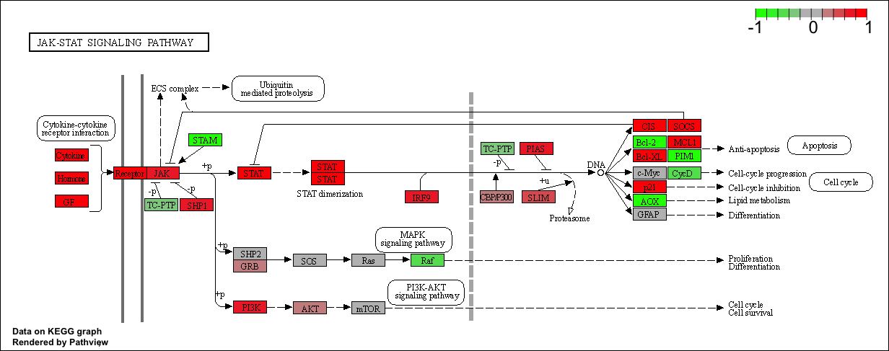
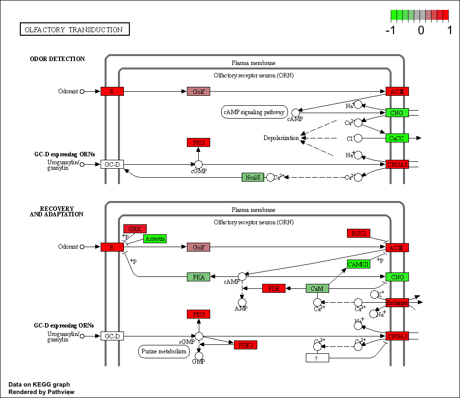
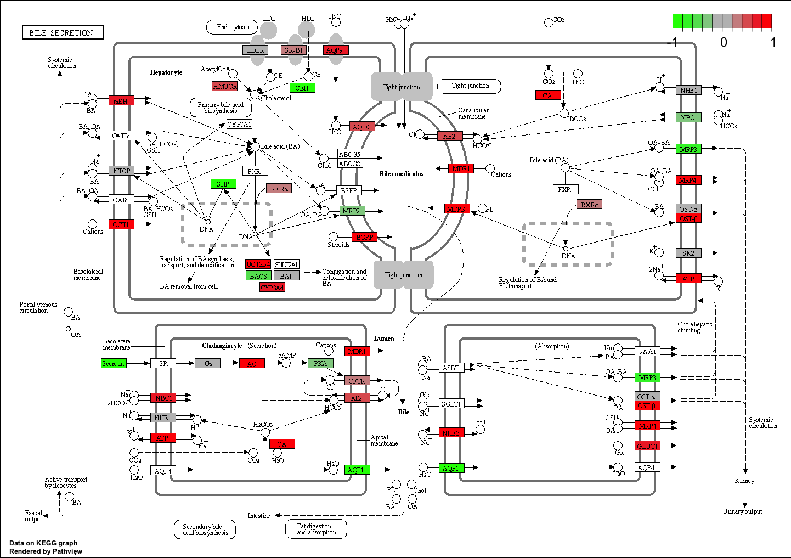
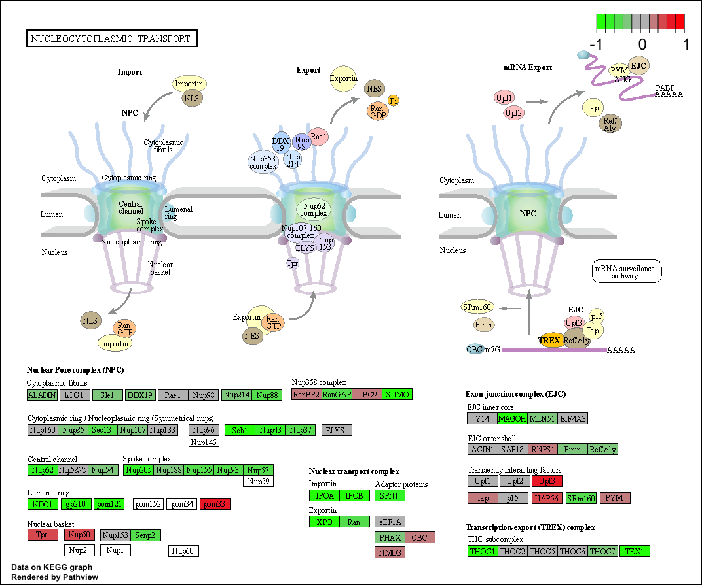

```{r}
metaFile <- "GSE37704_metadata.csv"
countFile <- "GSE37704_featurecounts.csv"

# Import metadata and take a peek
colData = read.csv(metaFile, row.names=1)
head(colData)
```

```{r}
# Import countdata
countData = read.csv(countFile, row.names=1)
head(countData)
```

**Q1.** Complete the code below to remove the troublesome first column from countData. We need to get rid of this funny first column.

```{r}
countData <- countData[, -1]
head(countData)
#We should have 6 rows and 6 columns! If we run the [, -1] code again and again, each time it will get rid of the first column until you're left with 0 columns. 
```

**Q2.** Complete the code below to filter countData to exclude genes (i.e. rows) where we have 0 read count across all samples (i.e. columns).

```{r}
head(countData)
countsnozero <- countData[rowSums(countData) !=0,]
```

```{r}
# BiocManager::install("DESeq2")
library(DESeq2)
dds = DESeqDataSetFromMatrix(countData=countData,
                             colData=colData,
                             design=~condition)
dds = DESeq(dds)
dds
```

**Q3.** Call the summary() function on your results to get a sense of how many genes are up or down-regulated at the default 0.1 p-value cutoff.

```{r}
res = results(dds, contrast=c("condition", "hoxa1_kd", "control_sirna"))

summary(res)
```

##Volcano Plot

```{r}
plot( res$log2FoldChange, -log(res$padj) )
```

**Q4.** Improve this plot by completing the below code, which adds color and axis labels.

```{r}
# Make a color vector for all genes
mycols <- rep("gray", nrow(res) )

# Color red the genes with absolute fold change above 2
mycols[ abs(res$log2FoldChange) > 2 ] <- "red"

# Color blue those with adjusted p-value less than 0.01
#  and absolute fold change more than 2
inds <- (res$pvalue < 0.01) & (abs(res$log2FoldChange) > 2 )
mycols[ inds ] <- "blue"

plot( res$log2FoldChange, -log(res$padj), col=mycols, xlab="Log2(FoldChange)", ylab="-Log(P-value)" )
```

```{r}
library("AnnotationDbi")
library("org.Hs.eg.db")
columns(org.Hs.eg.db)
res$symbol <- mapIds(org.Hs.eg.db,
                     keys=row.names(res),
                     keytype="ENSEMBL",
                     column="ENTREZID",
                     multiVals="first")
res$entrez = mapIds(org.Hs.eg.db,
                    keys=row.names(res),
                    keytype="ENSEMBL",
                    column="ENTREZID",
                    multiVals="first")

res$name =   mapIds(org.Hs.eg.db,
                    keys=row.names(res),
                    keytype="ENSEMBL",
                    column="ENTREZID",
                    multiVals="first")

head(res, 10)
```

```{r}
pca <- prcomp(t(countsnozero))
mycols <- rep(c("red", "blue"), each=3)
plot(pca$x[,1:2], col=mycols, pch=16)
```

```{r}
# Run in your R console (i.e. not your Rmarkdown doc!)
# BiocManager::install( c("pathview", "gage", "gageData") )

library(pathview)
library(gage)
library(gageData)

# Focus on datasubset of KEGG
data(kegg.sets.hs)
data(sigmet.idx.hs)

# Focus on signaling and metabolic pathways only
kegg.sets.hs = kegg.sets.hs[sigmet.idx.hs]

# Examine the first 3 pathways
head(kegg.sets.hs, 3)
```

```{r}
foldchanges = res$log2FoldChange
names(foldchanges) = res$entrez
head(foldchanges)
```

Let's run the gage pathway analysis.

```{r}
# Get the results
keggres = gage(foldchanges, gsets=kegg.sets.hs)

attributes(keggres)
```

Let's look at the first few down-regulat4ed (less) pathways.

```{r}
head(keggres$less)
```

Using the **pathview()** function, we will make pathway plot for the RNASeq. expression results.

```{r}
pathview(gene.data=foldchanges, pathway.id="hsa04110")
```


```{r}
# A different PDF based output of the same data
pathview(gene.data=foldchanges, pathway.id="hsa04110", kegg.native=FALSE)
```

```{r}
## Focus on top 5 upregulated pathways here for demo purposes only
keggrespathwaysup <- rownames(keggres$greater)[1:5]

# Extract the 8 character long IDs part of each string
keggresidsup = substr(keggrespathwaysup, start=1, stop=8)
keggresidsup
```

Let's use **pathview()** for all top 5 up-regulated pathways.
```{r}
pathview(gene.data=foldchanges, pathway.id=keggresidsup, species="hsa")
```







**Q7.** Can you do the same procedure as above to plot the pathview figures for the top 5 down-reguled pathways?
```{r}
## Focus on top 5 down-regulated pathways here for demo purposes only
keggrespathwaysdown <- rownames(keggres$less)[1:5]

# Extract the 8 character long IDs part of each string
keggresidsdown = substr(keggrespathwaysdown, start=1, stop=8)
keggresidsdown
```
```{r}
pathview(gene.data=foldchanges, pathway.id=keggresidsdown, species="hsa")
```




## Gene Ontology
```{r}
data(go.sets.hs)
data(go.subs.hs)

# Focus on Biological Process subset of GO
gobpsets = go.sets.hs[go.subs.hs$BP]

gobpres = gage(foldchanges, gsets=gobpsets, same.dir=TRUE)

lapply(gobpres, head)
```

## Reactome Analysis

We can also do a similar procedure with gene ontology. Similar to above, go.sets.hs has all GO terms. go.subs.hs is a named list containing indexes for the BP, CC, and MF ontologies. Let’s focus on BP (a.k.a Biological Process) here.

## Reactome Analysis

Reactome is database consisting of biological molecules and their relation to pathways and processes.

```{r}
# output the list of significant genes at the 0.05 level as a plain text file:
sig_genes <- res[res$padj <= 0.05 & !is.na(res$padj), "symbol"]
print(paste("Total number of significant genes:", length(sig_genes)))
```

```{r}
write.table(sig_genes, file="significant_genes.txt", row.names=FALSE, col.names=FALSE, quote=FALSE)
```

**Q8.** What pathway has the most significant “Entities p-value”? Do the most significant pathways listed match your previous KEGG results? What factors could cause differences between the two methods?

```{r}
# Performed significant gene analysis on https://reactome.org/PathwayBrowser/#TOOL=AT website. Downloaded pathway analysis results for genes with most significant p values as .csv file. Read file using **read.csv()** function.
mostsignificant <- read.csv(file="result.csv")
head(mostsignificant)
```

