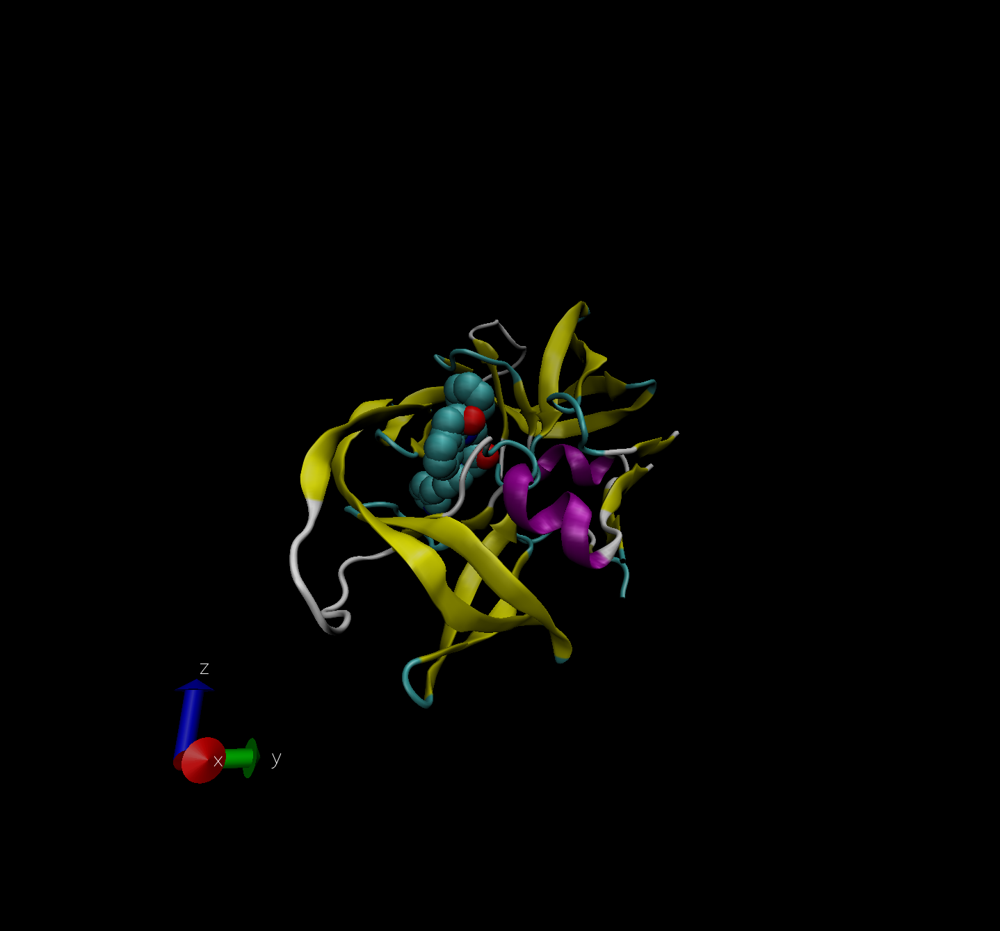

# Introduction to the RCSB Protein Data Bank (PDB)

Download and read CSV file

```{r}
db <- read.csv("Data Export Summary.csv", row.names = 1)
head(db)
```

**Q1.** What percentage of structures in the PDB are solved by X-Ray and Electron Microscopy?

```{r}
method.sums <- colSums(db)
round((method.sums/method.sums["Total"])*100, 2)
```

**Q2.** What proportion of structures in the PDB are protein?

```{r}
round((db$Total/method.sums["Total"])*100, 2)
```

**Q3.** Type HIV in the PDB website search box on the home page and determine how many HIV-1 protease structures are in the current PDB?

1,828 protease stucture for HIV-1.

# Visualizing the HIV-1 protease structure

**Q4.** Water molecules normally have 3 atoms. Why do we see just one atom per water molecule in this structure?

Only the oxygen atom is shown for each water molecule because water is a small atom

Q5: There is a conserved water molecule in the binding site. Can you identify this water molecule? What residue number does this water molecule have (see note below)?




# Using Bio3D

I need to load the library
```{r}
library(bio3d)
pdb <- read.pdb("1hsg")
pdb
```
```{r}
# Gives the sequence of amino acids
pdbseq(pdb)

# To convert amino acids into 3-letter code, use...
aa123(pdbseq(pdb))
```
```{r}
head(pdb$atom)
```


